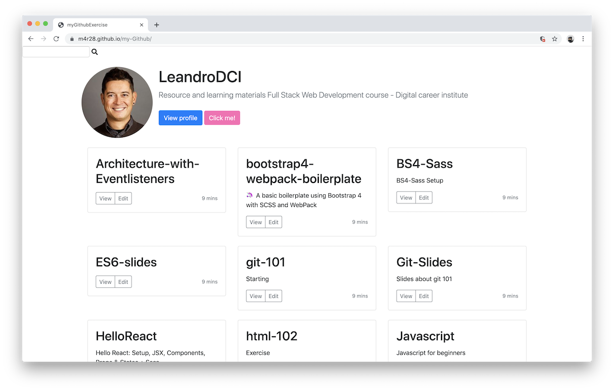

# myGithub

A web app that consumes the Github Api with a search option that allows to browse users and view their profile and their public repositories.

## Tech stack: 
- HTML5
- CSS
- JavaScript
- Bootstrap

## Preview

## Demo

Try the [live demo](https://m4r28.github.io/my-Github/).

## Note
Project uses [Cornify](https://www.cornify.com/) under 'Click me!' button which does not work on Github Pages live demo. 